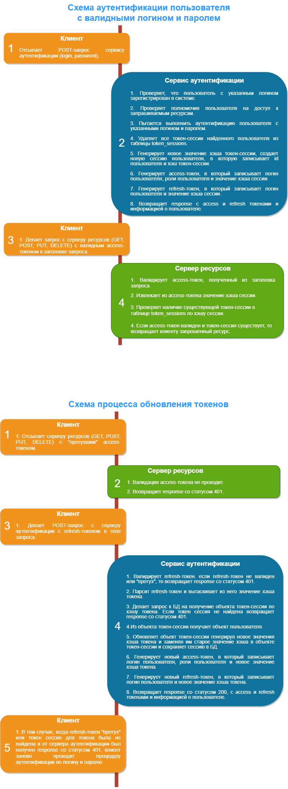

## Java Spring App Authentication Server

Сервер аутентификации и авторизации на Java с использованием JWT токенов.

---

Токен сессии необходимы для реализации механизма Logout. При выходе пользователя
из системы, соответствующая ему запись в таблице токен-сессий будет удалена, но токены
будут валидны еще некоторое время.
Поэтому, если после выхода пользователя из системы серверу ресурсов будет отправлен
запрос с валидным access-токеном, то в доступе будет отказано. При отправке запроса
сервису аутентификации на обновление токенов по refresh-токену будет также выполнена
проверка на наличие токен-сессии в таблице токен-сессий по хэшу, извлеченному из
refresh-токена.

Кроме того, в данном подходе реализован механизм Only one active device, т.е.
в таблице токен-сессий хранится только один хэш для каждого user id. Таким
образом, когда пользователь войдет в систему с другого устройства, то старая
связка hash-userId перезапишется и с предыдущего устройства пользователь уже
не сможет обращаться к серверу.